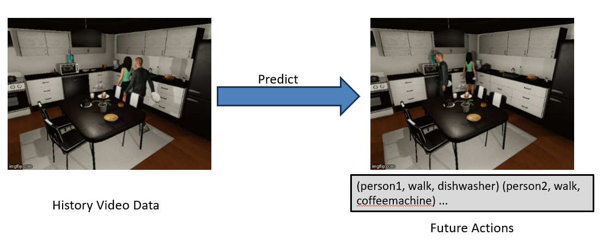
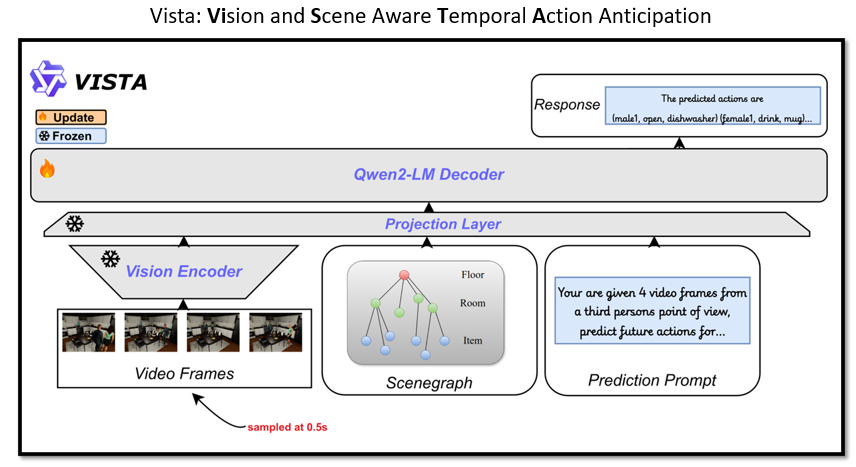
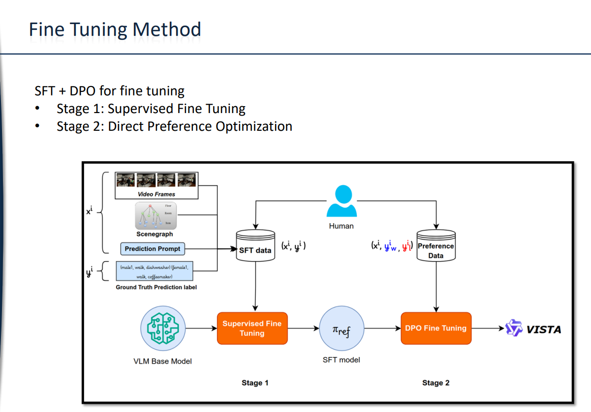

## Multi-Human Behavior Prediction using Vision Language Models
The repository contains code that is used to run the experiments for my research.  

Given Video data, the objective is to predict future actions of humans in the scene. Read Full Thesis [here](https://panchalutsav.github.io/files/Utsav_Master_Thesis.pdf). 

<p align="center">
	
</p>

## Architecture 
<p align="center">
	
</p>


## Fine Tuning Method
It contains two stage of fine tuning method. 
<p align="center">
	
</p>


#### Create the environment 
``` 
conda env create -f environment.yml
```


**main.py** contains the overall code. You can choose to either fine tune or to infer from the model by modifying the following lines in **main.py**. 

``` 
finetune = 1
infer = 0
``` 

The paths to the dataset is listed in the **configs/general.yaml**. Theere are paths to SFT data & preference data for DPO. The fine tuning is essentially done in two stages. SFT and DPO. 
``` 
python main.py
``` 

### SFT tuning 
**sft.py** contains the main code for fine tuning the VLM. The hyperparameters is listed in **configs/sftconfig.yaml**.   

**general.yaml** -> this contains the paths for storing and loading the adapters. 
When the Supervised Fine Tuning is done, the adapters are saved in **SFT_OUTPUT_DIR**. Note that adapters are only seperate weights. To use them you need to attach the adapter weights into the main model. This is done automatically by the **main.py** file. In case you want to infer from the SFT model only, you can use these adapters seperately. For DPO fine tuning, it is necessary to merge the adapters into the main model. This is already talen care by the **main.py** file. 


## DPO tuning 
**dpo.py** contains the main code for DPO fine tuning. This is done after the SFT fine tuning. The main hyper parameters of DPO fine tuning are listed in the **configs/dpoconfig.yaml** file.  

#### DPO preference data 
For DPO preference data, you need to get outputs from the SFT model. Set the **main.py** to infer mode and Load the Model from the **SFT_MODEL_DIR** and set the **EPISODES** to 10.  
Comment the following line no. 99 to get inference only from the SFT model. 

```
# attach DPO adapters to SFT model, or you can directly infer SFT model
model.load_adapter(DPO_ADAPTERS_DIR)
```
 

### Files for GPU cluster

These folder contains the files you can directly run inside the GPU cluter. The bsub files are also given. The two bsub files are for two different stage of fine tuning methods. 
```
bsub < run_sft.bsub
bsub < run_dpo.bsub
```

#### Evaluation
To run the evaluation, simply add the output file in the following line. 
Qwen-72b-kitchen2.csv is the output file.
```
filename = "/home/pau1rng/utsav/codes/multi-human-behavior-prediction/ftoutputs/qwen72b-kitchen2.csv"
```

The simply run 
```
python evaluation.py
```
